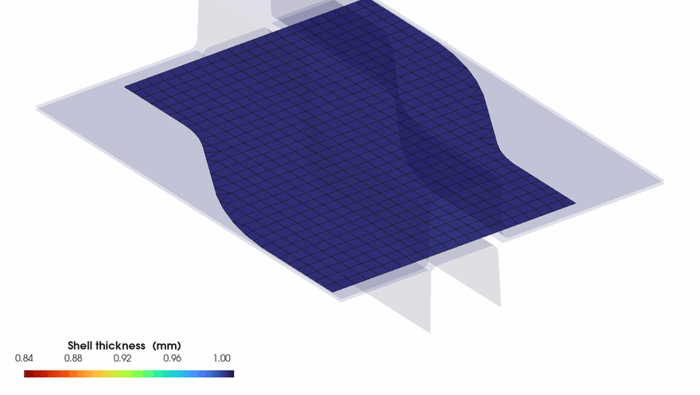
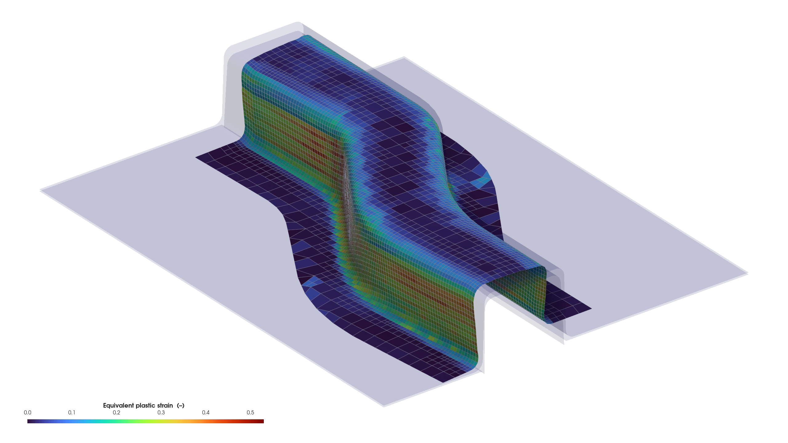

# MinuteSim

### GPU-Resident Explicit Finite Element Solver

## **From model to result — in minutes.**

**High-throughput explicit FEA for shell forming, large deformation,
and contact-intensive structural analysis on NVIDIA GPUs.**

[Performance](docs/performance.md) ·
[Validation](docs/validation.md) ·
[Benchmarks](docs/benchmarks.md) ·
[Publications](docs/publications.md)

---

## See MinuteSim in Action

**S-rail full-stroke forming** 
GPU explicit shell simulation with adaptive local refinement.

This is a MinuteSim shell simulation result. Independent accuracy evidence is reported
separately in [Validation](docs/validation.md).

---

## Performance

<table>
<tr>
<td align="center" width="50%">
<h1>≈220×</h1>
<b>Shell GPU Speedup</b> 
Latest internal Nakajima benchmark 
vs published LS-DYNA MPP R14.1 1-core timing
</td>
<td align="center" width="50%">
<h1>137.6×</h1>
<b>Solid GPU/CPU Speedup</b> 
Peer-reviewed benchmark 
vs MinuteSim single-thread CPU path
</td>
</tr>
</table>

<h3>2.1 min</h3>

**Full ~505,000-element shell forming benchmark**, 15,808 explicit steps 
Latest internal MinuteSim result — see benchmark scope below

<table>
<tr>
<td align="center" width="50%">

 
<b>Shell throughput</b> 
125.1 s wall time · per-step speedup vs published LS-DYNA reference
</td>
<td align="center" width="50%">

 
<b>Solid scaling</b> 
up to 137.6× · published scaling study · 83 K to 1.89 M elements
</td>
</tr>
</table>

<b>Benchmark scope and comparison basis</b>

**Shell.** The latest MinuteSim internal runtime on the ~505,000-element Nakajima deck is
**125.1 s** over 15,808 explicit steps. Against the *published* LS-DYNA MPP R14.1 reference
timing that is approximately **224.8×** per step at 1 core and **69.3×** at 32 cores. This is
an internal measurement compared against published reference timing rather than a fresh
reference run; its hardware and precision have not been reconfirmed, so it is **not** claimed
as a same-workstation comparison.

**Solid.** The **137.6×** figure is MinuteSim GPU single precision against **MinuteSim's own**
single-thread CPU double-precision path on the published benchmark. It is **not** a
cross-solver comparison.

Every speedup is specific to its benchmark, hardware, precision and configuration. MinuteSim
makes no product-wide multiplier claim.

[Full benchmark methodology →](docs/performance.md)

---

## What MinuteSim Solves

<table>
<tr>
<td width="50%" valign="top">

<h3>Sheet-Metal Forming</h3>

GPU-resident explicit shell analysis for large-deformation forming.

<ul>
<li>MITC4 shell formulation</li>
<li>Large-deformation kinematics</li>
<li>Contact and friction</li>
<li>Elastoplastic material response</li>
<li>Adaptive local mesh refinement</li>
<li>Shell thickness output</li>
<li>Equivalent plastic strain output</li>
</ul>

</td>
<td width="50%" valign="top">

<h3>Solid Large-Deformation Analysis</h3>

GPU-resident explicit solid analysis for nonlinear deformation and contact.

<ul>
<li>Tetrahedral solid elements</li>
<li>Elastoplastic response</li>
<li>Rigid-to-deformable contact</li>
<li>Large-deformation kinematics</li>
<li>Scaling to millions of elements</li>
<li>Single- and double-precision builds</li>
</ul>

</td>
</tr>
</table>

---

## Simulation Results

<table>
<tr>
<td align="center" width="50%">

 
<b>S-rail Shell Forming</b> 
Equivalent plastic strain at full stroke
</td>
<td align="center" width="50%">

 
<b>Solid Hemisphere Compression</b> 
Effective plastic strain
</td>
</tr>
</table>

[Thickness result](assets/srail-shell-thickness.png) ·
[GIF animation](assets/srail-shell-thickness-animation.gif) ·
[MP4 animation](assets/srail-shell-thickness-animation.mp4)

The S-rail case is a **capability demonstration, not a validation result** — no reference
solution is compared against it. Measured shell accuracy comes from the Nakajima benchmark,
in [Validation](docs/validation.md).

---

## Validated Accuracy

<table>
<tr>
<td align="center" width="25%">
<h2>2.95%</h2>
<b>Shell stress</b> 
Mean von Mises difference vs Abaqus/Explicit, over 94% of specimen elements
</td>
<td align="center" width="25%">
<h2>2.08%</h2>
<b>Shell thickness</b> 
Maximum difference vs Abaqus/Explicit
</td>
<td align="center" width="25%">
<h2>1.69%</h2>
<b>Solid force</b> 
Difference from closed-form reference
</td>
<td align="center" width="25%">
<h2>1.0%</h2>
<b>Contact radius</b> 
Difference from closed-form reference
</td>
</tr>
</table>

**Shell validation** — 10,000-element Nakajima benchmark against Abaqus/Explicit 2024 HF3,
S4 shells.

**Solid validation** — independent closed-form normal-contact solution.

[Explore validation evidence →](docs/validation.md)

---

## Why MinuteSim

<table>
<tr>
<td align="center" width="25%" valign="top">
<b>Results in minutes</b> 
MinuteSim was built around a simple goal: make practical explicit finite-element analysis fast enough that engineers can get results in minutes rather than waiting hours.
</td>
<td align="center" width="25%" valign="top">
<b>GPU-first computation</b> 
Designed for high-throughput explicit finite-element analysis on NVIDIA GPUs.
</td>
<td align="center" width="25%" valign="top">
<b>Validated against independent references</b> 
Shell forming is compared with Abaqus/Explicit. Solid contact is compared with a closed-form analytical reference.
</td>
<td align="center" width="25%" valign="top">
<b>Peer-reviewed development</b> 
The solver, its validation studies, and its benchmark results are documented in two peer-reviewed 2026 publications.
</td>
</tr>
</table>

---

## Peer-Reviewed Evidence

**A GPU-Resident MITC4 Shell Solver for a Nakajima Hemispherical-Dome Forming Benchmark:
Verification, Abaqus Validation, and LS-DYNA Throughput Benchmarking** 
*Applied Sciences* 16(12), 5826, 2026 ·
[Read the paper →](https://doi.org/10.3390/app16125826)

**Design and Computational Efficiency of a GPU-Resident Integrated Execution Pipeline for
Explicit Large-Deformation Finite Element Analysis** 
*Journal of Manufacturing and Materials Processing* 10(6), 197, 2026 ·
[Read the paper →](https://doi.org/10.3390/jmmp10060197)

---

## Availability

**MinuteSim 0.9.0 Beta**

Windows x64 · NVIDIA GPU (Volta or newer) · Single / Double Precision

The Microsoft Visual C++ Redistributable is required and is not bundled.

MinuteSim is proprietary and is not distributed from this repository, which holds its public
documentation and published evidence. For beta access or technical evaluation, please
[open an issue](https://github.com/Hong-pro/MinuteSim/issues).

---

## Technical Resources

[Performance](docs/performance.md) ·
[Validation](docs/validation.md) ·
[Benchmarks](docs/benchmarks.md) ·
[Publications](docs/publications.md)

[Limitations](docs/limitations.md) ·
[Documentation Governance](docs/DOCUMENTATION_GOVERNANCE.md)
