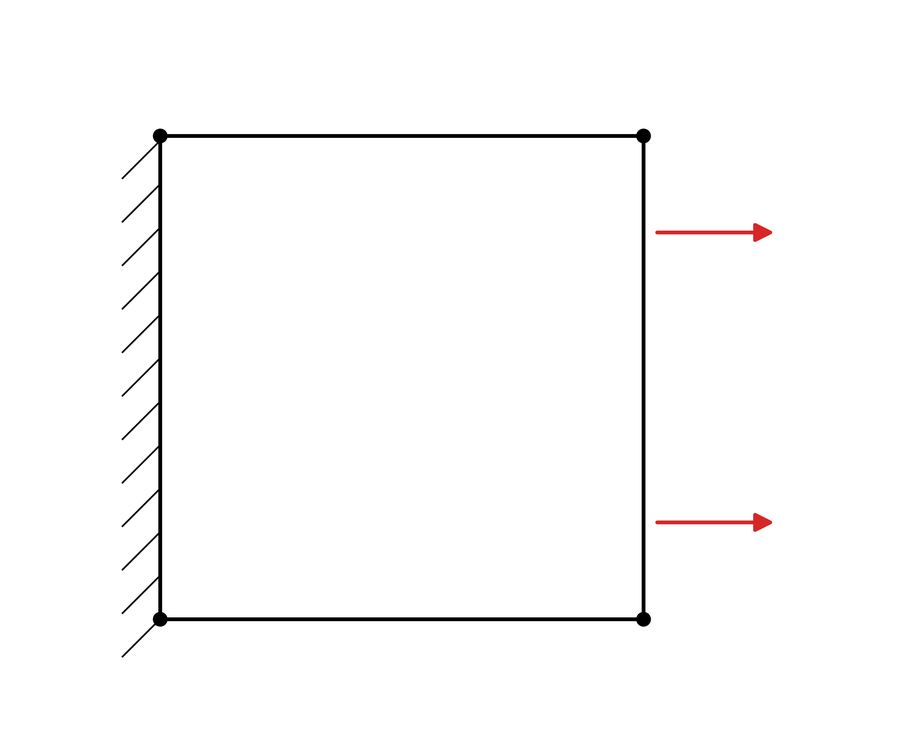
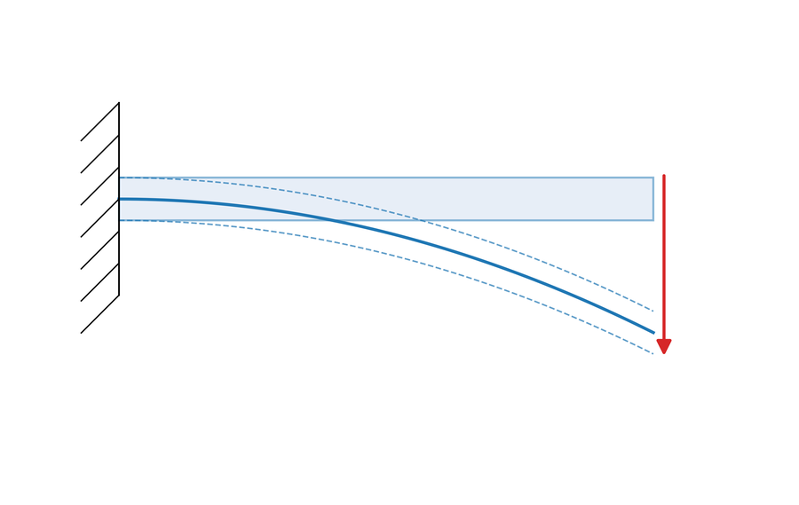
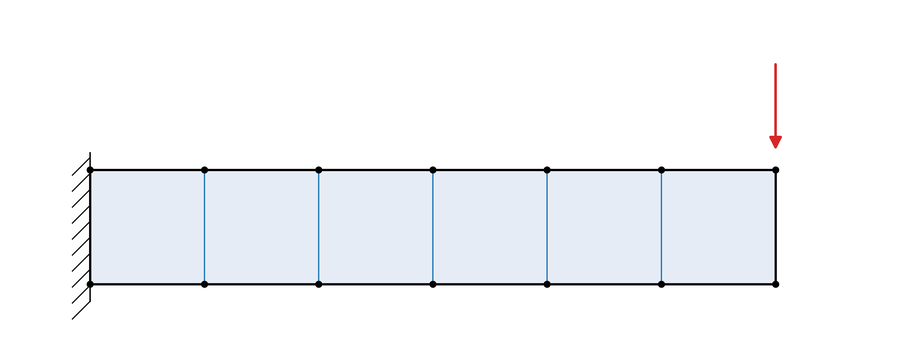
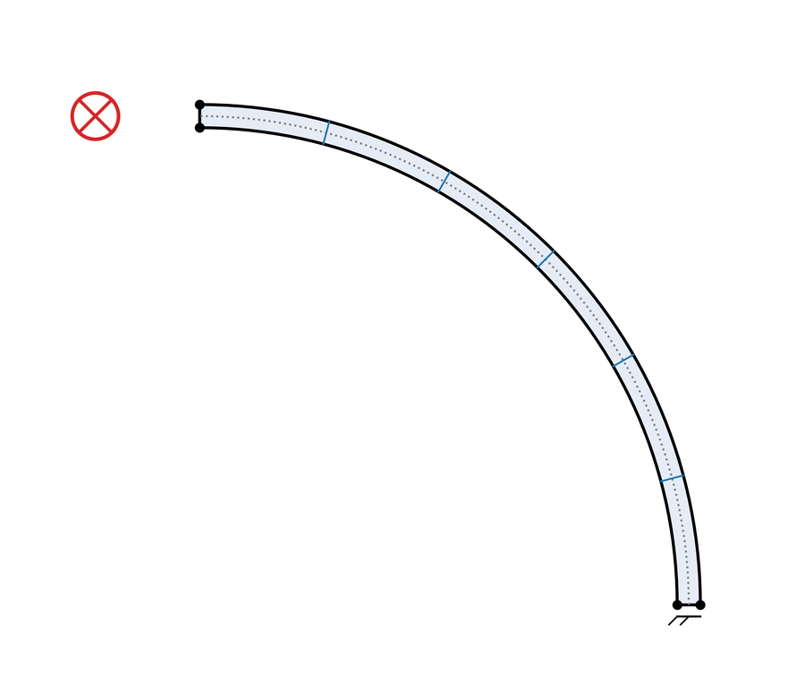
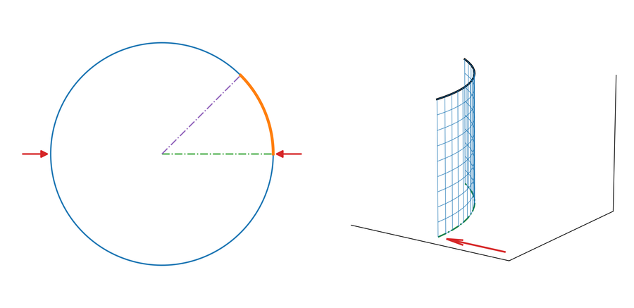

# Benchmarks

The public benchmark matrix. Each entry names its purpose, the evidence it produces, and the
publication it comes from, so a reader can tell at a glance which cases establish accuracy and which
establish throughput.

**Purpose** is one of:

| Purpose | Meaning |
|---|---|
| `VALIDATION` | Compared against an independent reference — another solver, or a closed-form solution |
| `CONVERGENCE` | Mesh refinement series showing the discretization error trend |
| `THROUGHPUT` | Wall-time measurement; not an accuracy claim |
| `SCALING` | Performance across model size |
| `SELF-CONSISTENCY` | Internal check against MinuteSim's own reference, or one MinuteSim path against another |
| `DIAGNOSTIC` | Run to locate or characterize a behaviour, not to certify agreement |
| `INSUFFICIENT EVIDENCE` | The case exists and its inputs are published, but no result metric is |

Publications: **[AS]** = [Applied Sciences 16(12), 5826](https://doi.org/10.3390/app16125826) ·
**[JMMP]** = [JMMP 10(6), 197](https://doi.org/10.3390/jmmp10060197)

---

## Canonical shell benchmark models

The five element-level verification cases, as load-case schematics. Their measured results are in
the shell table below and in [Validation](validation.md).

<table>
<tr align="center">
<td width="20%"></td>
<td width="20%"></td>
<td width="20%"></td>
<td width="20%"></td>
<td width="20%"></td>
</tr>
<tr align="center">
<td>Membrane patch</td>
<td>Bending patch</td>
<td>Straight cantilever</td>
<td>Curved cantilever</td>
<td>Pinched cylinder</td>
</tr>
</table>

No published model schematic exists for the Nakajima dome or for the solid cases, so those rows
carry no thumbnail rather than an invented one. The solid hemisphere-compression geometry is shown
in the result figure on the [README](../README.md).

## Shell benchmarks

| Benchmark | Element | Model size | Purpose | Evidence | Precision | Publication |
|---|---|---|---|---|---|---|
| Membrane patch test | MITC4 | 1 element | `VALIDATION` | 0.000 % vs closed-form plane-strain elasticity | FP64 | [AS] |
| Bending patch test | MITC4 | 1 element | `SELF-CONSISTENCY` | 0.10 % vs MinuteSim's own stable single-element value | FP64 | [AS] |
| Straight cantilever, force-driven | MITC4 | 1 × 6 | `VALIDATION` | 1.65 % vs MacNeal & Harder (0.4321 mm reference) | FP64 | [AS] |
| Curved cantilever, in/out-of-plane shear | MITC4 | 5 elements along the arc | `VALIDATION` | +5.2 % / −5.1 % vs MacNeal & Harder | FP64 | [AS] |
| Pinched cylinder with end diaphragms | MITC4 | 4×4 → 32×32 octant | `CONVERGENCE` | −28 % → −0.6 % vs the normalized textbook reference 5.0 (MacNeal & Harder; Belytschko et al.) | FP64 | [AS] |
| Nakajima hemispherical dome | MITC4 | 10,000 | `VALIDATION` | Mean von Mises 2.95 % over 94 % of elements; max thickness 2.08 % vs Abaqus/Explicit 2024 HF3 (S4) | FP64 | [AS] |
| Nakajima contact pressure | MITC4 | 10,000 | `DIAGNOSTIC` | Active-contact-region comparison: reconstructed pressure proxy vs Abaqus CPRESS. No error metric; definition-consistent pressure validation is reported as remaining work | FP64 | [AS] |
| Nakajima mesh sensitivity | MITC4 | ~4,900 / 10,000 / ~19,900 | `CONVERGENCE` | Peak von Mises change 0.16 % from 10 K to 20 K | FP64 | [AS] |
| Nakajima friction sensitivity | MITC4 | 10,000 | `SELF-CONSISTENCY` | Monotonic response at μ = 0, 0.10, 0.12 | FP64 | [AS] |
| Nakajima penalty-scale sensitivity | MITC4 | 10,000 | `SELF-CONSISTENCY` | Under 0.3 % across a 20× penalty-scale span | FP64 | [AS] |
| Nakajima intermediate mesh, 40 mm stroke | MITC4 | ~50,000 | `INSUFFICIENT EVIDENCE` | Decks and Abaqus exports ship in the supplementary archive; no cross-code agreement metric is published at this stroke | FP64 | [AS] |
| Nakajima intermediate mesh, 80 mm stroke | MITC4 | 50,176 | `VALIDATION` | Section-mean von Mises +0.6 % globally, +0.4 % in the transition band; section-maximum transition-band gap −4.3 % | FP64 | [AS] |
| Nakajima throughput deck | MITC4 | ~505,000 | `THROUGHPUT` | 643 s / 15,808 steps on an NVIDIA L40; 43.7× / 17.7× / 13.5× per step vs LS-DYNA MPP R14.1 at 1 / 8 / 32 cores | FP64 | [AS] |

The intermediate-mesh cross-code result is published at the 80 mm production stroke only.

### S-rail full-stroke forming — demonstration case

An S-rail draw-forming case ships with the 0.9.0-beta.1 release package
(`benchmarks/srail/`). It runs the full stroke on an adaptively refined blank that grows from 675
to 6,963 elements, concentrating refinement in the S-bend and sidewalls while the flange stays
coarse.

It is **not** in the matrix above and carries no evidence class, because no reference solution,
error metric, or cross-code comparison is published for it. Its role is to show what a MinuteSim
shell run produces, which is why it supplies the shell image on the
[README](../README.md) — a full 3D formed part reads more directly there than a profile plot does.
Nakajima remains the shell **validation** benchmark and the basis of every accuracy figure in
[Validation](validation.md); the two are doing different jobs.

## Solid benchmarks

| Benchmark | Element | Model size | Purpose | Evidence | Precision | Publication |
|---|---|---|---|---|---|---|
| Rounded flat-punch contact | Tet4 | Coarse quarter domain | `VALIDATION` | Normal force +1.69 %, contact radius +1.0 % vs closed-form solution | FP32 | [JMMP] |
| Hemisphere compression, L1 | Tet4 | 82,944 | `SCALING` | 243.6 µs/step; 98.7× vs MinuteSim's single-thread CPU path | FP32 | [JMMP] |
| Hemisphere compression, L2 | Tet4 | 162,000 | `SCALING` | 386.0 µs/step; 116.5× vs MinuteSim's single-thread CPU path | FP32 | [JMMP] |
| Hemisphere compression, L3 | Tet4 | 384,000 | `SCALING` | 822.5 µs/step; 126.5× vs MinuteSim's single-thread CPU path | FP32 | [JMMP] |
| Hemisphere compression, L4 | Tet4 | 750,000 | `SCALING` | 1,391 µs/step; 134.7× vs MinuteSim's single-thread CPU path | FP32 | [JMMP] |
| Hemisphere compression, L5 | Tet4 | 998,250 | `SCALING` | 1,829 µs/step; 137.6× vs MinuteSim's single-thread CPU path | FP32 | [JMMP] |
| Hemisphere compression, L6 | Tet4 | 1,886,592 | `SCALING` | 3,378 µs/step; 137.2× vs MinuteSim's single-thread CPU path | FP32 | [JMMP] |
| Hemisphere compression vs LS-DYNA SMP | Tet4 | 1,886,592 | `THROUGHPUT` | ≈ 94× faster than the best 8-core SMP configuration; SMP measured at 1/2/4/8/16/32 cores | FP32 | [JMMP] |
| Precision comparison | Tet4 | 162,000 | `SELF-CONSISTENCY` | GPU FP32 vs CPU FP64: von Mises 0.27 %, displacement 0.99 %, force history 0.31 % | FP32 vs FP64 | [JMMP] |
| Contact overhead | Tet4 | 162,000 / 384,000 / 998,250 | `SCALING` | Net contact ON/OFF difference: +20.9 % / +16.6 % / +13.0 %, falling with model size | FP32 | [JMMP] |

## Hardware

Both benchmark programs ran on the same class of machine:

| Component | Specification |
|---|---|
| GPU | NVIDIA L40, 48 GB GDDR6, Ada Lovelace, 300 W |
| CPU | AMD EPYC 75F3, 32-core |
| OS | Windows 10 |

## Reading this matrix

- A `THROUGHPUT` row is a wall-time result. It says nothing about accuracy, and the late-time state
  of a throughput deck is not offered as physically meaningful.
- A `SELF-CONSISTENCY` row compares MinuteSim against itself or against its own reference value. It
  is genuine evidence of internal stability, and it is **not** independent accuracy validation.
- `CONVERGENCE` rows report a trend, not a single number. A coarse-mesh deviation in a convergence
  series is expected behaviour; what matters is that the series converges.
- Precision is listed per row because the two publications used different precision, and figures from
  one should not be combined with figures from the other.

Detail lives in [Validation](validation.md) and [Performance](performance.md). Scope boundaries are
in [Limitations](limitations.md).
