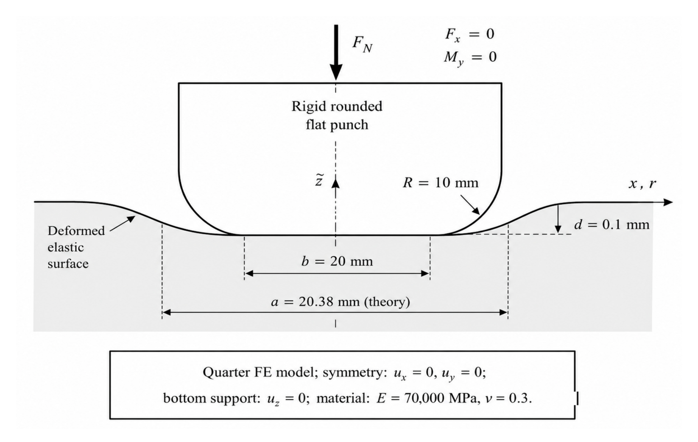

# Benchmark Cases

The models MinuteSim is measured on. This page describes **what problems are used**;
[Validation](validation.md) reports **how accurate** the results are, and
[Performance](performance.md) reports **how fast** they run. Numbers are not repeated here.

Publications: **[AS]** = [Applied Sciences 16(12), 5826](https://doi.org/10.3390/app16125826) ·
**[JMMP]** = [JMMP 10(6), 197](https://doi.org/10.3390/jmmp10060197)

## Case catalog

<table>
<tr>
<th align="left" width="24%">Model</th>
<th align="left">Case</th>
<th align="left">Element</th>
<th align="left">Model size</th>
<th align="left">Used for</th>
</tr>

<tr>
<td rowspan="7" align="center"> Nakajima dome</td>
<td>Forming validation vs Abaqus/Explicit</td><td>MITC4</td><td>10,000</td>
<td><a href="validation.md">Validation →</a></td>
</tr>
<tr><td>Contact-pressure diagnostic</td><td>MITC4</td><td>10,000</td><td><a href="validation.md">Validation →</a></td></tr>
<tr><td>Mesh sensitivity</td><td>MITC4</td><td>~4,900 / 10,000 / ~19,900</td><td><a href="validation.md">Validation →</a></td></tr>
<tr><td>Friction sensitivity</td><td>MITC4</td><td>10,000</td><td><a href="validation.md">Validation →</a></td></tr>
<tr><td>Penalty-scale sensitivity</td><td>MITC4</td><td>10,000</td><td><a href="validation.md">Validation →</a></td></tr>
<tr><td>Intermediate-mesh cross-code check</td><td>MITC4</td><td>50,176</td><td><a href="validation.md">Validation →</a></td></tr>
<tr><td>Large-model throughput deck</td><td>MITC4</td><td>~505,000</td><td><a href="performance.md">Performance →</a></td></tr>

<tr>
<td rowspan="3" align="center"> Hemisphere compression JMMP Fig. 2</td>
<td>Mesh-scaling study</td><td>Tet4</td><td>82,944 → 1,886,592</td><td><a href="performance.md">Performance →</a></td>
</tr>
<tr><td>Contact-overhead study</td><td>Tet4</td><td>162,000 / 384,000 / 998,250</td><td><a href="performance.md">Performance →</a></td></tr>
<tr><td>GPU FP32 vs CPU FP64 self-consistency</td><td>Tet4</td><td>162,000</td><td><a href="validation.md">Validation →</a></td></tr>

<tr>
<td align="center"> Rounded flat punch JMMP Fig. A1</td>
<td>Closed-form contact validation</td><td>Tet4</td><td>Coarse quarter domain</td>
<td><a href="validation.md">Validation →</a></td>
</tr>

<tr>
<td align="center"> S-rail</td>
<td>Full-stroke forming demonstration</td><td>MITC4</td><td>675 → 39,102 (adaptive, L3)</td>
<td><a href="../README.md">Demonstration →</a></td>
</tr>
</table>

The S-rail case is a **capability demonstration**. No reference solution is compared against it, so
it produces no accuracy claim. It does carry a cross-solver *runtime* comparison against
OpenRadioss — see [Performance](performance.md#s-rail-full-stroke-forming) — which measures speed,
not correctness.

Thumbnails marked with a figure number are the published figures, reproduced under CC BY 4.0 —
see [figure provenance](../assets/README.md). The Nakajima thumbnail is a render of the actual
release benchmark deck.

---

## Canonical shell benchmark models

The five element-level verification cases, as load-case schematics. Their measured results are in
[Validation](validation.md).

<table>
<tr align="center">
<td width="20%"></td>
<td width="20%"></td>
<td width="20%"></td>
<td width="20%"></td>
<td width="20%"></td>
</tr>
<tr align="center">
<td>Membrane patch</td>
<td>Bending patch</td>
<td>Straight cantilever</td>
<td>Curved cantilever</td>
<td>Pinched cylinder</td>
</tr>
</table>

## Detailed case index

Each case with its evidence class. Measured numbers are **not** repeated here — see
[Validation](validation.md) for accuracy and [Performance](performance.md) for speed.

**Purpose** is one of:

| Purpose | Meaning |
|---|---|
| `VALIDATION` | Compared against an independent reference — another solver, or a closed-form solution |
| `CONVERGENCE` | Mesh refinement series showing the discretization error trend |
| `THROUGHPUT` | Wall-time measurement; not an accuracy claim |
| `SCALING` | Performance across model size |
| `SELF-CONSISTENCY` | Internal check against MinuteSim's own reference, or one MinuteSim path against another |
| `DIAGNOSTIC` | Run to locate or characterize a behaviour, not to certify agreement |
| `INSUFFICIENT EVIDENCE` | The case exists and its inputs are published, but no result metric is |

### Shell benchmarks

| Benchmark | Element | Model size | Purpose | Precision | Publication | Details |
|---|---|---|---|---|---|---|
| Membrane patch test | MITC4 | 1 element | `VALIDATION` | FP64 | [AS] | [Validation →](validation.md) |
| Bending patch test | MITC4 | 1 element | `SELF-CONSISTENCY` | FP64 | [AS] | [Validation →](validation.md) |
| Straight cantilever, force-driven | MITC4 | 1 × 6 | `VALIDATION` | FP64 | [AS] | [Validation →](validation.md) |
| Curved cantilever, in/out-of-plane shear | MITC4 | 5 elements along the arc | `VALIDATION` | FP64 | [AS] | [Validation →](validation.md) |
| Pinched cylinder with end diaphragms | MITC4 | 4×4 → 32×32 octant | `CONVERGENCE` | FP64 | [AS] | [Validation →](validation.md) |
| Nakajima hemispherical dome | MITC4 | 10,000 | `VALIDATION` | FP64 | [AS] | [Validation →](validation.md) |
| Nakajima contact pressure | MITC4 | 10,000 | `DIAGNOSTIC` | FP64 | [AS] | [Validation →](validation.md) |
| Nakajima mesh sensitivity | MITC4 | ~4,900 / 10,000 / ~19,900 | `CONVERGENCE` | FP64 | [AS] | [Validation →](validation.md) |
| Nakajima friction sensitivity | MITC4 | 10,000 | `SELF-CONSISTENCY` | FP64 | [AS] | [Validation →](validation.md) |
| Nakajima penalty-scale sensitivity | MITC4 | 10,000 | `SELF-CONSISTENCY` | FP64 | [AS] | [Validation →](validation.md) |
| Nakajima intermediate mesh, 40 mm stroke | MITC4 | ~50,000 | `INSUFFICIENT EVIDENCE` | FP64 | [AS] | [Validation →](validation.md) |
| Nakajima intermediate mesh, 80 mm stroke | MITC4 | 50,176 | `VALIDATION` | FP64 | [AS] | [Validation →](validation.md) |
| Nakajima throughput deck | MITC4 | ~505,000 | `THROUGHPUT` | FP64 | [AS] | [Performance →](performance.md) |

The intermediate-mesh cross-code result is published at the 80 mm production stroke only.

### S-rail full-stroke forming

An S-rail draw-forming case ships with the release package under `benchmarks/srail/`. It runs the
complete 9.9 ms stroke on an adaptively refined blank, concentrating refinement in the S-bend and
sidewalls while the flange stays coarse.

**Two refinement levels ship**, driven by `*CONTROL_ADAPTIVE MAXLVL` on the same deck and the same
stroke. They exist so the effect of problem size can be measured rather than argued:

| Deck | `MAXLVL` | Blank at start | Blank at full stroke | Explicit steps |
|---|---:|---:|---:|---:|
| `srail_l2.k` | 3 | 675 | 10,044 | 40,494 |
| `srail_l3.k` | 4 | 675 | 39,102 | 79,926 |

Element counts throughout this page are the **deformable blank**, which is the only part that
refines. The rigid tools are meshed too, but their 1,265 shells never change and are excluded — a
count that mixes them in overstates the deformable model.

The finer deck is not simply "more elements": the smaller elements drive a smaller stable time
step, so L3 runs roughly twice the steps of L2 as well as four times the elements.

**Model.** A deformable blank (`*MAT_024`, piecewise-linear plasticity with a 251-point hardening
curve) drawn between three rigid tools. Coulomb friction, penalty contact, and adaptive shell
refinement with a 2-to-1 rule and explicit state transfer at every refinement epoch.

**What it is for.** This case carries **no evidence class**, because no reference solution or error
metric is published for it. It has two jobs:

1. **Capability demonstration** — it supplies the shell imagery on the [README](../README.md),
   where a fully formed 3D part reads more directly than a profile plot.
2. **Runtime comparison** — the cross-solver timing against OpenRadioss in
   [Performance](performance.md#s-rail-full-stroke-forming), which is a wall-clock comparison and
   **not** an accuracy comparison.

Nakajima remains the shell **validation** benchmark and the basis of every accuracy figure in
[Validation](validation.md). The two cases are doing different jobs, and neither substitutes for
the other.

**Reading the imagery.** The contour bars are display windows, not the measured extremes. Both
fields are strongly one-sided — a fraction of a percent of the elements sits far outside the bulk —
so a bar anchored to the raw minimum and maximum collapses the whole part into one colour. Measured
over the L3 stroke:

| Field | Full measured range | p1 – p99 | Display window |
|---|---|---|---|
| Shell thickness | 0.903 – 1.147 mm | 0.947 – 1.038 | 0.94 – 1.05 |
| Equivalent plastic strain | 0.000 – 1.925 | 0.000 – 0.520 | 0.00 – 0.30 |

Values outside a window clamp to its end colour, so the thinning and high-strain hot spots saturate
rather than being averaged away. The mesh is drawn only on the detail views: at ~39,000 elements a
refined element in the wide framing is a few pixels across, and a one-pixel edge would cover the
contour it exists to show.

**Reproducing it.** The package ships `run_srail_l2_cuda.bat` and `run_srail_l3_cuda.bat`. Both
set `FASTGPU_ADPENE=1` and call the solver with `--compute-backend cuda`. Results are written as
HDF5 with an XDMF index. The published imagery is rendered from that output by
`assets/shell/srail/render_srail_fullstroke.py`, and the performance figure by
`render_srail_performance.py` beside it — neither is hand-edited afterwards.

### Solid benchmarks

| Benchmark | Element | Model size | Purpose | Precision | Publication | Details |
|---|---|---|---|---|---|---|
| Rounded flat-punch contact | Tet4 | Coarse quarter domain | `VALIDATION` | FP32 | [JMMP] | [Validation →](validation.md) |
| Hemisphere compression, L1 | Tet4 | 82,944 | `SCALING` | FP32 | [JMMP] | [Performance →](performance.md) |
| Hemisphere compression, L2 | Tet4 | 162,000 | `SCALING` | FP32 | [JMMP] | [Performance →](performance.md) |
| Hemisphere compression, L3 | Tet4 | 384,000 | `SCALING` | FP32 | [JMMP] | [Performance →](performance.md) |
| Hemisphere compression, L4 | Tet4 | 750,000 | `SCALING` | FP32 | [JMMP] | [Performance →](performance.md) |
| Hemisphere compression, L5 | Tet4 | 998,250 | `SCALING` | FP32 | [JMMP] | [Performance →](performance.md) |
| Hemisphere compression, L6 | Tet4 | 1,886,592 | `SCALING` | FP32 | [JMMP] | [Performance →](performance.md) |
| Hemisphere compression vs LS-DYNA SMP | Tet4 | 1,886,592 | `THROUGHPUT` | FP32 | [JMMP] | [Performance →](performance.md) |
| Precision comparison | Tet4 | 162,000 | `SELF-CONSISTENCY` | FP32 vs FP64 | [JMMP] | [Validation →](validation.md) |
| Contact overhead | Tet4 | 162,000 / 384,000 / 998,250 | `SCALING` | FP32 | [JMMP] | [Performance →](performance.md) |

## Hardware

Both benchmark programs ran on the same class of machine:

| Component | Specification |
|---|---|
| GPU | NVIDIA L40, 48 GB GDDR6, Ada Lovelace, 300 W |
| CPU | AMD EPYC 75F3, 32-core |
| OS | Windows 10 |

## Reading this matrix

- A `THROUGHPUT` row is a wall-time result. It says nothing about accuracy, and the late-time state
  of a throughput deck is not offered as physically meaningful.
- A `SELF-CONSISTENCY` row compares MinuteSim against itself or against its own reference value. It
  is genuine evidence of internal stability, and it is **not** independent accuracy validation.
- `CONVERGENCE` rows report a trend, not a single number. A coarse-mesh deviation in a convergence
  series is expected behaviour; what matters is that the series converges.
- Precision is listed per row because the two publications used different precision, and figures from
  one should not be combined with figures from the other.

Detail lives in [Validation](validation.md) and [Performance](performance.md). Scope boundaries are
in [Limitations](limitations.md).
