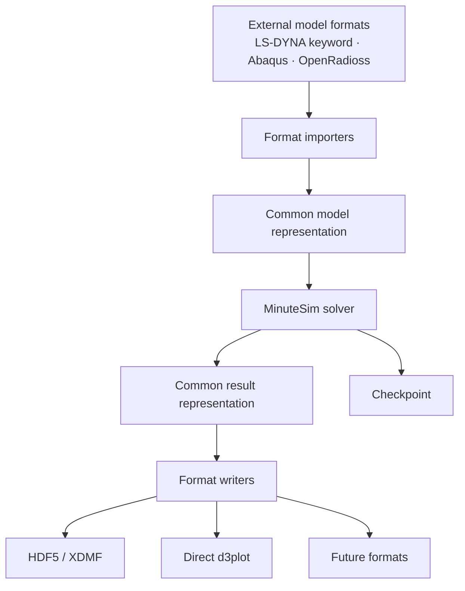

# MinuteSim I/O Architecture Roadmap

MinuteSim is evolving toward a format-independent I/O architecture that separates model import,
solver execution, result export, and restart/checkpoint handling. Today the solver reads a selected
subset of LS-DYNA-style keyword input and writes XDMF over HDF5. The direction of travel is to make
both ends pluggable, so that adding a format does not mean touching the numerical core.

This page describes intent and current status. It is a roadmap, not a delivery commitment — see
[Roadmap](roadmap.md) for how MinuteSim separates *implemented*, *validated* and *released*.

## The shape it is moving toward

The point of the two "common representation" stages is that an external format never reaches the
numerical core, and the numerical core never has to know which format a result will end up in.

## 1. Model import

| Capability | Status |
|---|---|
| LS-DYNA-style keyword input, selected subset | **Implemented** |
| Rejection or reporting of unsupported input rather than silent approximation | **Qualification ongoing** |
| Abaqus input | **Planned** |
| OpenRadioss input | **Planned** |
| Format-independent importer interface | **Planned** |

MinuteSim reads a *subset* of LS-DYNA-style keyword syntax. It is an independently developed
solver, not compatible with or a drop-in replacement for any commercial code — see
[Limitations](limitations.md) for what that means in practice.

A supported keyword may still ignore individual fields, and the solver reports that at run time.
Making unsupported input fail loudly rather than quietly is part of the planned import work.

## 2. Result export

| Capability | Status |
|---|---|
| XDMF over HDF5 result output | **Implemented** |
| Asynchronous result and checkpoint output | **Implemented** |
| `*DATABASE_BINARY_D3PLOT` accepted as an output-cadence setting | **Implemented** |
| Direct d3plot output from the solver | **Planned** |
| Format-independent writer interface | **Planned** |
| Several output formats written from one solver pass | **Planned** |

**On d3plot.** MinuteSim does not currently write d3plot files. The `*DATABASE_BINARY_D3PLOT`
keyword is read, but only to set how often results are written — it does not select a d3plot
writer. Direct d3plot output is planned as a first-class writer that takes solver results straight
to d3plot, with no intermediate conversion step.

## 3. Restart and checkpoint

| Capability | Status |
|---|---|
| Periodic checkpoint writing, with a user-settable interval | **Implemented** |
| Checkpoint written on the asynchronous path | **Implemented** |
| Restart from a checkpoint as a documented user workflow | **Not documented — treat as unavailable** |
| Checkpoint schema versioning and compatibility guarantees | **Planned** |

Restart is treated as a different problem from result output, not as another export format. A
result file may legitimately carry a selected subset of fields for visualization; a checkpoint has
to carry everything needed to continue the analysis, and it cannot be allowed to silently lose a
frame. That difference drives the design.

Checkpoint writing is exercised in shipped benchmark runs. **Resuming** from a checkpoint is not
part of the documented interface today, and this page does not claim it works.

## 4. Asynchronous output

MinuteSim already uses asynchronous result and checkpoint I/O in selected workflows. The roadmap
extends this approach toward format-independent, multi-backend output while minimizing interruption
to GPU computation.

The planned extension is that when more than one output format is active, the solver state is
captured once and shared, rather than captured separately for each format.

## Status vocabulary

Consistent with [Roadmap](roadmap.md):

| Term | Meaning |
|---|---|
| **Implemented** | Present and reachable in the current release |
| **Qualification ongoing** | Functional; validation or release qualification in progress |
| **Planned** | A defined development direction. No implementation claim |
| **Not shipped** | Exists outside the release package |

No target month is given for any planned item on this page, because none has been approved. Target
months appear in [Roadmap](roadmap.md) only once they are set.
