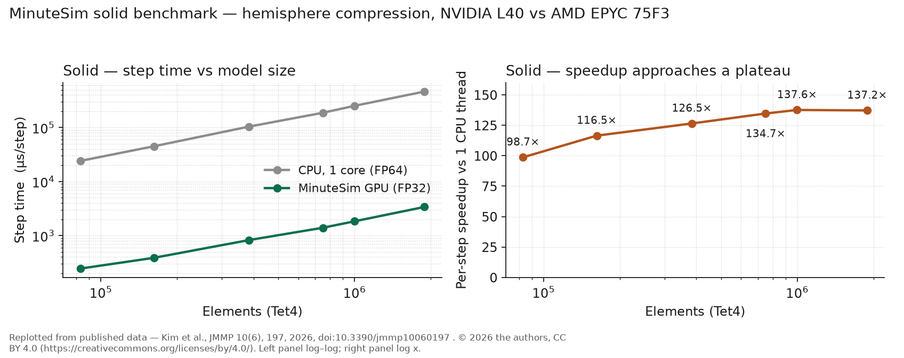
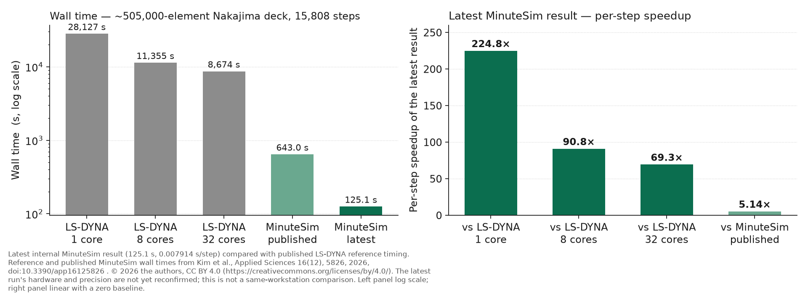
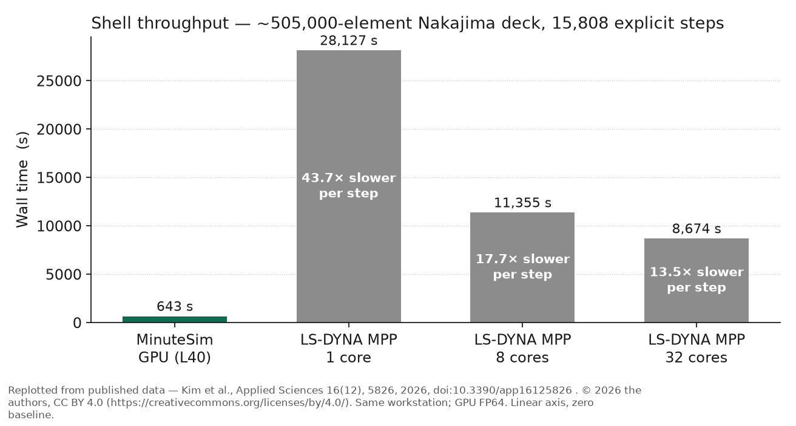

# Performance

MinuteSim keeps the whole explicit time step on the GPU. This page reports what that produces on
benchmark workloads, with the hardware, precision, model, and comparison basis attached to every
number.

Most figures here come from the two peer-reviewed publications listed in
[Publications](publications.md) — [Applied Sciences 16(12), 5826](https://doi.org/10.3390/app16125826)
for shell and [JMMP 10(6), 197](https://doi.org/10.3390/jmmp10060197) for solid.

**One exception:** the "Shell — latest internal result" section below reports an **internal
measurement that has not been published**. Its hardware and precision have not been reconfirmed, and
it is compared against the *published* LS-DYNA reference timing rather than a fresh reference run.
It is marked as such where it appears.

## Summary

| Domain | Benchmark | MinuteSim | Comparison | Result |
|---|---|---|---|---|
| Solid | Hemisphere compression, 1.89 M Tet4 | 3,378 µs/step (L40, FP32) | MinuteSim's single-thread CPU path (EPYC 75F3, FP64) | **137.2×** per step |
| Solid | Same, six mesh levels, 83 K → 1.89 M elements | — | MinuteSim's single-thread CPU path | **98.7×** at 83 K, peak **137.6×** near 1 M, **137.2×** at 1.89 M |
| Solid | Same problem | single GPU | LS-DYNA SMP, best 8-core configuration | **≈ 94×** faster |
| Shell | Nakajima dome, ~505 K elements | 643 s / 15,808 steps (L40, FP64) | LS-DYNA MPP R14.1, 1 / 8 / 32 cores | **43.7× / 17.7× / 13.5×** per step |

---

## Solid — hemisphere compression

### Configuration

| Item | Value |
|---|---|
| Benchmark | Hemisphere compression, rigid punch against a deformable block |
| Element | Tet4, single-point integration |
| Model sizes | Six levels: 82,944 · 162,000 · 384,000 · 750,000 · 998,250 · 1,886,592 elements |
| GPU | NVIDIA L40, 48 GB GDDR6, Ada Lovelace, 300 W |
| CPU | AMD EPYC 75F3, 32-core |
| Precision | GPU single precision; CPU reference double precision |
| Statistic | Median of three runs; output disabled during timing, first 200 steps excluded as warm-up |
| Execution mode | GPU graph capture disabled — not the shipped default |
| CPU baseline | MinuteSim's own CPU path, single thread. This is a GPU-versus-CPU comparison of the same solver, not a comparison against a third-party code. |

### Measured step times

| Level | Elements | MinuteSim CPU, 1 thread (µs/step) | MinuteSim GPU (µs/step) | Per-step speedup |
|---|---|---|---|---|
| L1 | 82,944 | 24,053 | 243.6 | **98.7×** |
| L2 | 162,000 | 44,966 | 386.0 | **116.5×** |
| L3 | 384,000 | 104,012 | 822.5 | **126.5×** |
| L4 | 750,000 | 187,375 | 1,391.0 | **134.7×** |
| L5 | 998,250 | 251,752 | 1,829.0 | **137.6×** |
| L6 | 1,886,592 | 463,434 | 3,378.0 | **137.2×** |

### Scaling behaviour

Speedup rises with model size and flattens: from about 99× at 83 K elements to a peak near 138× at
about 1 M elements, holding near 137× at 1.89 M. Larger models amortize fixed per-step overhead over
more work, and the curve plateaus once that overhead is no longer the limiter.

This is a useful property in practice — the advantage does not erode as models grow into the range
where explicit analysis is expensive.

### Contact cost

Enabling contact adds a net **+13 % to +21 %** to step time, measured at three mesh levels —
162,000, 384,000 and 998,250 elements (+20.9 %, +16.6 %, +13.0 % respectively). The overhead falls
as the model grows. This is a net contact-ON minus contact-OFF difference under the published
instrumentation, not an isolated contact-kernel time.

### Against LS-DYNA in shared-memory mode

On the same problem, MinuteSim on a single GPU is **roughly 94× faster than the best 8-core LS-DYNA
SMP configuration**. LS-DYNA SMP scalability was measured at 1, 2, 4, 8, 16, and 32 cores; the margin
reflects the multicore saturation observed in those measurements.

This is a **shared-memory** comparison. The published solid study states that the distributed-memory
picture is substantively different and identifies a balanced distributed-memory comparison as work
not yet done. The shell throughput benchmark below does use a distributed-memory reference, but on a
different solver path, a different element type, and a different problem — it is not evidence about
solid distributed-memory scaling.

---

## Shell — latest internal result

A more recent internal run of the same ~505,000-element Nakajima deck over the same
15,808-step window completed in **125.1 s**, i.e. **0.007914 s/step**.

| Comparison basis | Latest per-step speedup |
|---|---|
| LS-DYNA MPP R14.1, 1 core (published reference timing) | **224.8×** |
| LS-DYNA MPP R14.1, 8 cores (published reference timing) | **90.8×** |
| LS-DYNA MPP R14.1, 32 cores (published reference timing) | **69.3×** |
| MinuteSim's own published build (643 s) | **5.14×** improvement |

**This result is internal and not yet published.** It is compared against the *published*
LS-DYNA reference timing rather than a fresh reference run. The latest run's hardware and
precision have not been reconfirmed, so — unlike the published comparison below — **it is
not a same-workstation comparison**, and it should not be read as one. Treat it as
`EXPERIMENTAL` evidence pending publication of its configuration.

## Shell — published Nakajima dome throughput

The peer-reviewed throughput comparison, retained here as the historical reference basis.
These are the figures the latest result above is measured against.

### Configuration

| Item | Value |
|---|---|
| Benchmark | Nakajima hemispherical-dome forming, throughput deck |
| Model size | ~505,000 shell elements |
| Window | 1.0 × 10⁻³ s, 15,808 explicit steps |
| GPU | NVIDIA L40 |
| CPU | AMD EPYC 75F3, 32-core, same workstation |
| Precision | Double precision |
| Reference solver | LS-DYNA MPP R14.1, ELFORM 16 shells |

### Results

| Configuration | Wall time | Per-step time | Per-step speedup |
|---|---|---|---|
| **MinuteSim, GPU** | **643 s** | 0.0407 s | — |
| LS-DYNA MPP, 1 core | 28,127 s | 1.779 s | **43.7×** |
| LS-DYNA MPP, 8 cores | 11,355 s | 0.718 s | **17.7×** |
| LS-DYNA MPP, 32 cores | 8,674 s | 0.549 s | **13.5×** |

Both solvers ran on the same workstation, so the comparison is like-for-like in hardware.

### Interpretation

The speedup shrinks as CPU cores are added, as it should — 32 cores of LS-DYNA MPP close most of the
gap to 8 cores, but the distributed-memory scaling is sublinear, so the GPU advantage persists at
every core count measured.

This is a **throughput** measurement. Accuracy for the shell path is established on the
10,000-element deck, documented in [Validation](validation.md), not on this one. The late-time state
of a throughput deck is not offered as physically meaningful.

---

## Scope of these numbers

Read every figure on this page with its configuration attached. Specifically:

**No product-wide multiplier exists.** "MinuteSim is N× faster" is not a claim MinuteSim makes. The
supported form names the benchmark, the hardware, the precision, and the comparison basis — as the
tables above do.

**Precision differs between the two studies.** The solid results are GPU single precision against a
double-precision CPU reference; the shell throughput result is double precision throughout. Do not
combine a figure from one with a figure from the other.

**Cross-solver timings are user-measured** on a single workstation with vendor-default reference-solver
settings, and could shift on a tuned cluster. The LS-DYNA input decks and raw timing logs are not part
of the published supplementary archives, so a third party cannot re-derive those rows from the
published material. These are runtime benchmarks, not a total-cost-of-ownership analysis.

**I/O and initialization inclusion is not stated** in the published record for the shell throughput
comparison. That matters for a CPU-versus-GPU ratio and is an open question rather than an assumption.

**The shell throughput figure predates the shipped build.** It was measured on an earlier build and
has not been reproduced on the current beta; the release package's own documentation says so.

**The solid benchmark configuration is not the shipped configuration.** The published solid runs used
a contact configuration and an execution mode that differ from the shipped defaults.

**One benchmark is not a performance model.** Each row is one deck, one mesh, one GPU, one precision,
one window. Extrapolating to a different model, element mix, or machine is not supported by this
evidence.

---

## Reproducing these results

The benchmark input decks and processed result data for the shell work are published in the
supplementary archive accompanying the Applied Sciences paper. The solid benchmark configuration is
documented in the JMMP paper. See [Benchmarks](benchmarks.md) for the full matrix.
