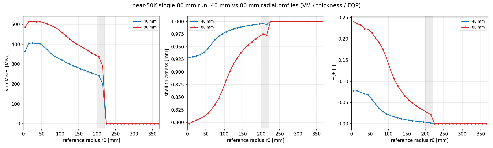
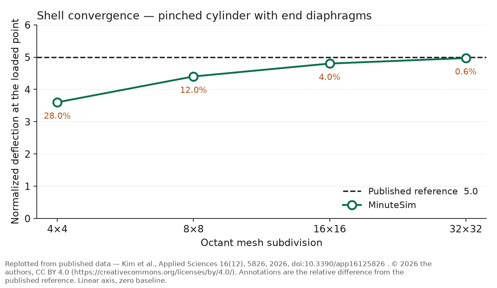
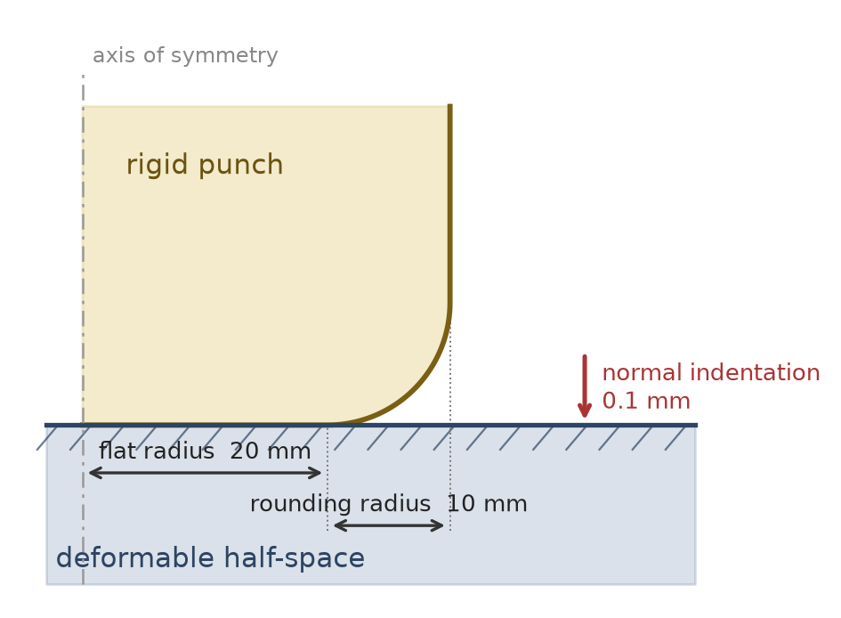
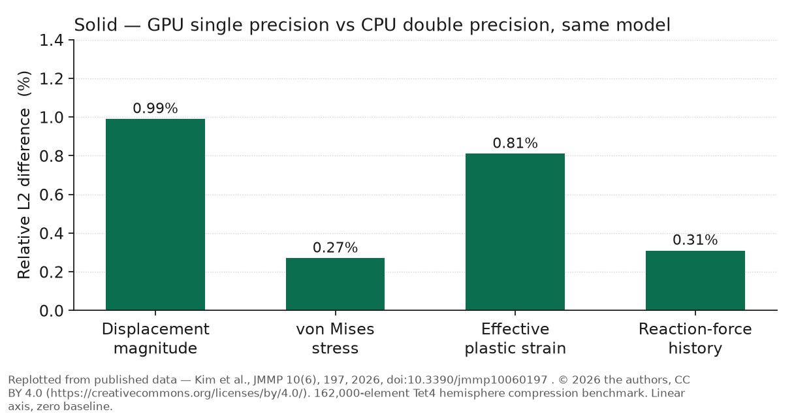

# Validation and Accuracy

MinuteSim's numerical accuracy is established by published benchmarks in two domains: shell forming
against a commercial reference solver, and solid large-deformation contact against a closed-form
solution and a double-precision reference path.

Sources: [Applied Sciences 16(12), 5826](https://doi.org/10.3390/app16125826) (shell) and
[JMMP 10(6), 197](https://doi.org/10.3390/jmmp10060197) (solid). Both open access.

## Summary

| Domain | What was compared | Result |
|---|---|---|
| Shell forming | Nakajima dome, 10 K elements, vs Abaqus/Explicit 2024 HF3 (S4) | Mean von Mises difference **2.95 %** over **94 %** of specimen elements; max thickness difference **2.08 %** |
| Shell forming | 50 K-element check at 80 mm stroke | Section-mean von Mises **+0.6 %** globally, **+0.4 %** in the transition band |
| Shell element | MacNeal–Harder cantilevers | Straight cantilever **1.65 %**; curved cantilever about **±5 %** |
| Shell element | Pinched cylinder, mesh refinement | **−28 %** at 4×4 octant converging to **−0.6 %** at 32×32 |
| Solid contact | Rounded flat punch vs closed-form solution | Normal force **+1.69 %**, contact radius **+1.0 %** |
| Solid precision | GPU FP32 vs CPU FP64, identical 162 K-element model | von Mises **0.27 %**, displacement **0.99 %**, force history **0.31 %** |

---

## Shell

### Nakajima forming validation against Abaqus/Explicit

<table>
<tr>
<td width="46%"></td>
<td width="54%" valign="top">

**Nakajima hemispherical-dome forming**

- 520 × 520 mm blank, 1.0 mm thick
- Hemispherical punch, radius 200 mm
- 10,000 shell elements, 80 mm stroke
- Reference: Abaqus/Explicit 2024 HF3, S4 shells

**Result:** 2.95 % mean von Mises difference over 94 % of specimen
elements; 2.08 % maximum thickness difference.

</td>
</tr>
</table>

The primary shell validation is a Nakajima hemispherical-dome benchmark compared against
Abaqus/Explicit 2024 HF3 using S4 shells, in double precision.

| Item | Value |
|---|---|
| Blank | 520 × 520 mm, 1.0 mm thick |
| Punch | Hemispherical, radius 200 mm |
| Stroke | 80 mm |
| Friction | Frictionless baseline (μ = 0) |
| Material | Swift isotropic hardening, K = 693.14, ε₀ = 0.002, n = 0.2 |
| Mesh | 10,000 shell elements |

**Result.** Mean von Mises difference of **2.95 % over 94 % of specimen elements**, with a maximum
shell-thickness difference of **2.08 %**. Thickness is the quantity a forming engineer usually cares
about most, and it agrees to about two percent across the dome.

An independent check on the 50,176-element intermediate mesh at 80 mm stroke stays bounded, with
section-mean von Mises differences of **+0.6 %** globally and **+0.4 %** in the transition band. On
the section-maximum peak-fibre measure the transition-band gap on that mesh is **−4.3 %** — a marked
improvement on the 10,000-element result below, and evidence that the peak-fibre gap narrows with
refinement.

MinuteSim radial profiles on that intermediate mesh — von Mises, thickness and equivalent plastic
strain at 40 mm and 80 mm stroke. Both curves are MinuteSim; the figure shows how the profiles
develop with stroke, and is not itself the cross-code comparison.

### How agreement varies by region

Agreement is strongest where the material is being formed. Zone-mean equivalent plastic strain,
MinuteSim against Abaqus/Explicit:

| Zone | r (mm) | Abaqus | MinuteSim | Difference |
|---|---|---|---|---|
| Pole | 0–25 | 0.2247 | 0.2402 | +6.9 % |
| Dome | 25–100 | 0.1876 | 0.1911 | +1.9 % |
| Shoulder | 100–200 | 0.0594 | 0.0609 | +2.5 % |
| Transition band | 200–221 | 0.0283 | 0.0255 | −9.9 % |
| Clamped flange | 221–364 | ~0 | ~0 | not meaningful |

The active forming zones agree to within about 7 % at the zone-mean level, with no factor-of-two
zone-mean discrepancy anywhere. Clamped-flange strains are near zero in both codes, so a ratio there
carries no information.

One property of the validated model shapes the edge behaviour and is worth knowing:
**the flange is restrained by a kinematic clamp rather than a binder contact pair.** In the published
setup the outer clamped ring also acts as the binder region. Blank-holder force, draw-in, and draw
beads are therefore outside this validation.

### Stress: state the fibre and the statistic

Stress agreement depends on which through-thickness fibre is compared:

| Definition | Pole | Dome | Transition band |
|---|---|---|---|
| Section-mean (like-for-like membrane) | −0.5 % | −1.3 % | +1.0 % |
| Section-maximum (like-for-like peak fibre) | −0.6 % | −1.7 % | **−10.9 %** |

The section-maximum result in the transition band is a real finding, not a bookkeeping artifact: the
published work attributes it to MinuteSim showing little through-thickness bending gradient in that
band. Any cross-code stress comparison should state which fibre and which statistic it uses.

### Contact pressure

MinuteSim's contact pressure is compared against Abaqus CPRESS at 80 mm stroke. The comparison
locates the active contact region rather than certifying a pressure field: the MinuteSim quantity is
a pressure proxy reconstructed from nodal normal contact force and tributary area, not a native
CPRESS field. On the 10,000-element validation mesh a localized high-radius pressure feature appears
near the transition band; on the 50,176-element fixed-flange intermediate mesh it does not. The
published work lists definition-consistent contact-pressure validation as remaining work.

### Canonical verification and convergence

Element-level verification against classical benchmark problems and closed-form solutions. The
schematics below show each load case before the numbers:

<table>
<tr align="center">
<td width="20%"></td>
<td width="20%"></td>
<td width="20%"></td>
<td width="20%"></td>
<td width="20%"></td>
</tr>
<tr align="center">
<td>Membrane patch</td>
<td>Bending patch</td>
<td>Straight cantilever</td>
<td>Curved cantilever</td>
<td>Pinched cylinder</td>
</tr>
</table>

| Benchmark | Reference | Reference is | MinuteSim | Difference |
|---|---|---|---|---|
| Membrane patch (mid-surface von Mises) | 976.72 MPa | Closed-form plane-strain elasticity | 976.72 MPa | 0.000 % |
| Bending patch (top-fibre von Mises) | 25.50 MPa | MinuteSim's own stable single-element value | 25.53 MPa | 0.10 % |
| Straight cantilever, tip deflection | 0.4321 mm | MacNeal & Harder | 0.4250 mm | 1.65 % |
| Curved cantilever, out-of-plane shear | 0.5022 | MacNeal & Harder | 0.47663 | −5.1 % |
| Curved cantilever, in-plane shear | 0.08734 | MacNeal & Harder | 0.09189 | +5.2 % |
| Pinched cylinder, 4×4 octant | 5.0 | MacNeal & Harder; Belytschko et al. | 3.60 | −28 % |
| Pinched cylinder, 8×8 octant | 5.0 | MacNeal & Harder; Belytschko et al. | 4.40 | −12 % |
| Pinched cylinder, 16×16 octant | 5.0 | MacNeal & Harder; Belytschko et al. | 4.80 | −4 % |
| Pinched cylinder, 32×32 octant | 5.0 | MacNeal & Harder; Belytschko et al. | 4.97 | **−0.6 %** |

The pinched-cylinder reference of 5.0 is a normalized radial deflection at the load point,
10⁵·E·t·u_r/P — a textbook value rather than a closed-form solution.

**The pinched-cylinder series is a convergence result.** A four-element-per-octant discretization of
a doubly-curved, bending-dominated shell is coarse, and the deviation falls monotonically —
28 % → 12 % → 4 % → 0.6 % — as the mesh is refined. That is the behaviour a shell element should
show. The practical reading is that curved, bending-dominated geometry needs mesh density, and
MinuteSim converges to the reference when given it.

Two rows are **not** comparisons against external literature, and should not be read as such: the
membrane patch is checked against a closed-form elasticity solution derived for that load case, and
the bending patch against MinuteSim's own stable single-element value. The first is a legitimate
analytical check; the second is **self-consistency, not independent accuracy validation**.

The two patch tests are posed in mm–MPa, and the straight-cantilever tip deflections are reported in
mm. The curved-cantilever and pinched-cylinder ordinates are normalized quantities, not lengths.

### Sensitivity

Robustness within the Nakajima family:

| Study | Range tested | Result |
|---|---|---|
| Mesh | ~4,900 / 10,000 / ~19,900 elements | Peak von Mises 559.8 → 546.3 → 545.4. The 10 K → 20 K change is **0.16 %**; the 5 K mesh is 2.5 % high |
| Contact penalty scale | 0.05 / 0.10 / 0.20 / 1.0 — a 20× span | Transition-band section-mean von Mises changes by **under 0.3 %** |
| Friction | μ = 0, 0.10, 0.12 | Monotonic increase in von Mises, plastic strain, and thinning |

Two notes on reading these. Minimum thickness converges more slowly than stress — about 1.3 % across
the same 10 K → 20 K refinement, versus 0.16 % for peak von Mises — so a mesh converged in stress is
not automatically converged in thinning. And in the published supplementary data, transition-band
thickness varies by under 0.05 % across the penalty sweep while equivalent plastic strain is somewhat
more sensitive than stress — about 0.7 % on the mean and 1.2 % on the maximum.

---

## Solid

### Contact validation against a closed-form solution

<table>
<tr>
<td width="46%"> 
Benchmark geometry schematic — not solver output</td>
<td width="54%" valign="top">

**Rounded flat-punch normal contact**

- Flat radius 20 mm, rounding radius 10 mm
- 0.1 mm normal indentation
- Quarter domain, coarse Tet4 mesh
- Reference: closed-form contact solution

**Result:** normal force +1.69 %, contact radius +1.0 %.

</td>
</tr>
</table>

The solid contact path is validated against a closed-form rounded-flat-punch normal-contact
solution, evaluated via the MDR identity following Willert (2024, §5.2) — an independent analytical
reference, not a solver-to-solver comparison. The analytical values were computed from that solution
rather than fitted to the finite-element result. No tangential force or moment is applied.

| Item | Value |
|---|---|
| Geometry | Rounded flat punch, flat radius 20 mm, rounding radius 10 mm |
| Approach | 0.1 mm normal indentation |
| Material | E = 70,000 MPa, ν = 0.3 |
| Model | Quarter domain with symmetry constraints, fixed base, coarse Tet4 mesh |

| Quantity | Analytical | MinuteSim | Difference |
|---|---|---|---|
| Contact radius | 20.38 mm | 20.591 mm | **+1.0 %** |
| Normal force | 311,211 N | 316,476 N | **+1.69 %** |
| Mean contact pressure | 238.49 MPa | 232.25 MPa | −2.6 % |

This is the coarse Tet4 case, and it evaluates the normal-contact response only. Internal
consistency of the contact output is tight: the pressure–area integral and the accumulated nodal
contact force differ by 6.3 × 10⁻¹¹.

### Single- versus double-precision agreement

<table>
<tr>
<td width="46%"></td>
<td width="54%" valign="top">

**Hemisphere compression**

- Rigid punch against a deformable block
- 162,000 Tet4 elements for this comparison
- J2 elastoplastic, node-to-surface penalty contact

**This is a self-consistency check**, GPU FP32 against MinuteSim's own
CPU FP64 path on the identical model — not an independent accuracy
comparison.

</td>
</tr>
</table>

MinuteSim's GPU path runs in single precision. To quantify what that costs, the same model was run on
the GPU in FP32 and on the CPU in FP64 and the fields compared directly.

| Item | Value |
|---|---|
| Model | Hemisphere compression, 162,000 Tet4 elements, 29,872 output nodes |
| Material | J2 elastoplastic, E = 210 GPa, ν = 0.3, σ_y = 250 MPa, tangent modulus 1 GPa |
| Contact | Automatic node-to-surface penalty, rigid punch against deformable block |
| Runtime | GPU 20.6 s versus 50.2 min single-thread CPU |

| Field | Relative L2 difference | Note |
|---|---|---|
| von Mises stress | **0.27 %** | Peak-stress difference 0.18 % |
| Reaction-force history | **0.31 %** | 0.22 % at peak |
| Effective plastic strain | **0.81 %** | Max absolute difference 6.8 × 10⁻³ |
| Displacement magnitude | **0.99 %** | Max absolute difference localized on the rigid punch rim, not the deformable block |

Contact stiffness agreed between the two paths to 1.9 × 10⁻⁵, and the reported solver scalars —
kinetic energy, maximum von Mises stress, maximum effective plastic strain — agree to four or five
significant figures.

The practical reading: for this class of problem, single precision costs a few tenths of a percent in
stress and force, and the largest displacement discrepancy sits on a rigid body rather than in the
deforming material.

---

## References

- R. H. MacNeal and R. L. Harder, "A proposed standard set of problems to test finite element
  accuracy," *Finite Elements in Analysis and Design*, **1**(1), 3–20, 1985.
  [doi:10.1016/0168-874X(85)90003-4](https://doi.org/10.1016/0168-874X(85)90003-4)
- T. Belytschko, W. K. Liu, B. Moran, and K. Elkhodary, *Nonlinear Finite Elements for Continua and
  Structures*, 2nd ed., John Wiley & Sons, Chichester, 2014. ISBN 978-1-118-63270-3
- E. Willert, "Elastic Stress Field beneath a Sticking Circular Contact under Tangential Load,"
  *Solids*, **5**(1), 14–28, 2024. [doi:10.3390/solids5010002](https://doi.org/10.3390/solids5010002)

MinuteSim's own publications are listed in [Publications](publications.md).

## What is not covered

This page reports what has been validated. Analysis outside these cases — other forming operations,
other material models, binder-contact draw operations, implicit analysis — has no published
validation evidence, and absence of evidence is neither a positive nor a negative claim. See
[Limitations](limitations.md) for the scope boundaries, and [Benchmarks](benchmarks.md) for the full
benchmark matrix.
